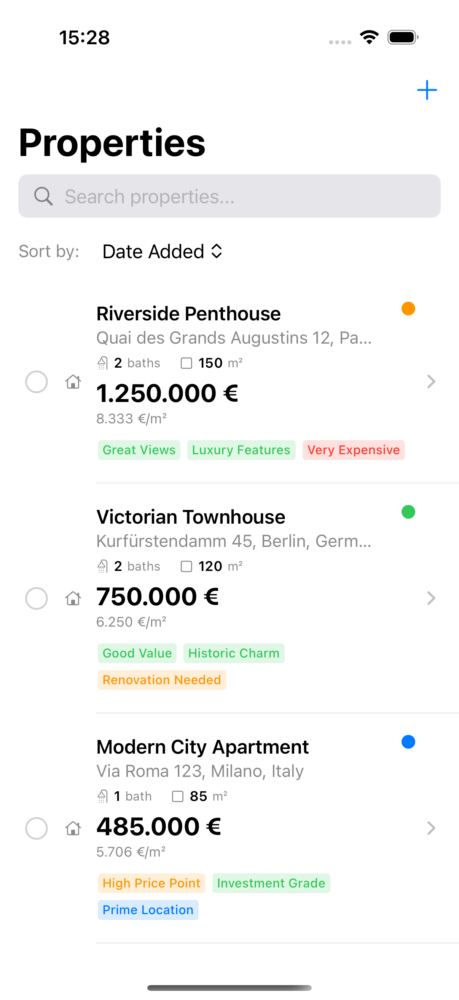
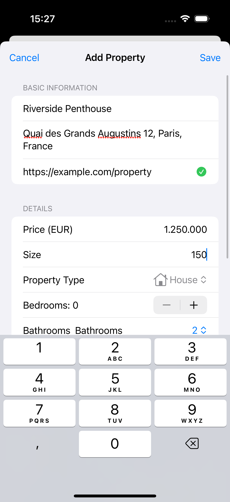
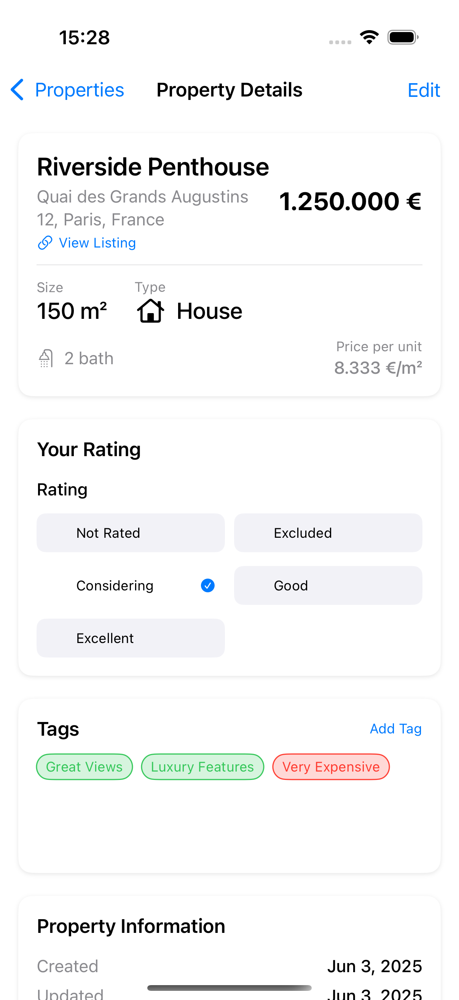
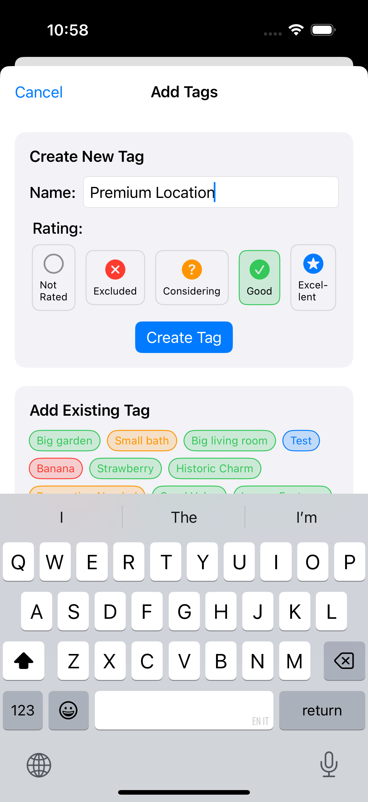
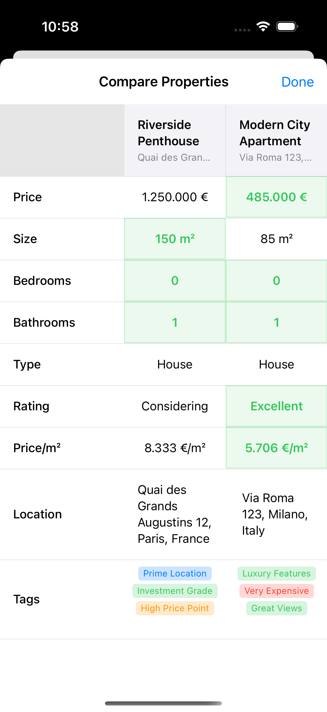

# Domori 🏠

> **AI Experiment**: This entire cross-platform app was built using [Cursor AI](https://cursor.com) as a proof-of-concept for AI-powered development. From initial concept to final implementation, every line of code, architecture decision, and feature was created through AI assistance.

A modern, production-ready property listing management app for iPhone, iPad, and macOS. Built with the latest Swift technologies and designed for real estate professionals, investors, and anyone managing property portfolios.

## 🤖 About This Project

This project represents an experiment in AI-powered software development using Cursor AI. The entire application was conceived, designed, and implemented through AI assistance, demonstrating the current capabilities of AI in creating production-ready, cross-platform mobile applications.

**Development Stack:**
- **AI Assistant**: Cursor AI (Claude Sonnet 4)
- **Language**: Swift 6.0
- **Frameworks**: SwiftUI, SwiftData, CloudKit
- **Platform**: iOS 18.5+, iPadOS 18.5+, macOS 14+, visionOS 2.5+
- **Testing**: swift-testing framework

## ✨ Features

### Core Functionality
- 📝 **Property Management**: Add, edit, and organize property listings with comprehensive details
- 🏷️ **Smart Tagging System**: Custom tags with rating-based color coding and many-to-many relationships
- ⭐ **Advanced Rating System**: PropertyRating enum with 5 levels (None, Excluded, Considering, Good, Excellent)
- 🔍 **Search & Filter**: Advanced search and multiple sorting options including rating-based sorting
- 📊 **Property Comparison**: Side-by-side analysis with automatic best value highlighting

### Property Details
- 🏠 **Basic Information**: Title, location, link, price, size, bedrooms, bathrooms, property type
- 📞 **Agent Contact**: Add agent phone numbers with tap-to-call and copy functionality
- 🎯 **Rating System**: Modern enum-based rating with visual color indicators
- 🏷️ **Custom Tags**: Create and assign unlimited custom tags with rating-based colors
- 🔗 **External Links**: Support for property listing URLs with automatic opening

### International Support
- 🌍 **Locale-Aware**: Automatic currency detection (USD, EUR, GBP, etc.)
- 📏 **Unit Adaptation**: Smart metric/imperial system detection with iOS 16+ measurementSystem API
- 🏛️ **Regional Formatting**: Native number and currency formatting
- 🗺️ **European Focus**: Optimized for European property markets with Euro pricing and metric units

### Advanced Features
- 📊 **Property Comparison**: Side-by-side analysis with best value highlighting for price/unit, bedrooms, bathrooms
- ☁️ **iCloud Sync**: Seamless synchronization across all devices via CloudKit
- 🎯 **Smart Sorting**: Date, price, size, title, and rating-based sorting options
- 💫 **Modern UI**: Beautiful SwiftUI interface with flow layouts and responsive design
- 🔄 **Data Migration**: Seamless migration from legacy rating systems
- 🖥️ **Cross-Platform**: Native UI adaptations for iOS, iPadOS, and macOS

## 🛠️ Technical Implementation

### Architecture
- **SwiftData**: Modern Core Data replacement for local persistence
- **CloudKit**: Automatic iCloud synchronization
- **SwiftUI**: Declarative UI framework with conditional compilation for platform-specific features
- **swift-testing**: Modern testing framework with comprehensive coverage

### Models
- `PropertyListing`: Main property model with relationships and migration support
- `PropertyRating`: Modern enum-based rating system (None, Excluded, Considering, Good, Excellent)
- `PropertyTag`: Custom tagging system with rating-based color coding
- `DataMigrationManager`: Handles smooth transitions between data model versions

### Key Technical Features
- **Cross-Platform Compatibility**: Conditional compilation for iOS/macOS differences
- **Modern APIs**: Uses latest iOS 16+ measurementSystem API with fallback support
- **Type-Safe Enums**: PropertyRating enum for better type safety than numeric ratings
- **Migration System**: Handles legacy data transitions seamlessly
- **Build Stability**: Resolved Swift compiler type-checking issues for complex UIs
- **Test Coverage**: Comprehensive unit tests including migration scenarios

## 🔄 Data Migration

The app includes a robust migration system that handles:
- Legacy `isFavorite` boolean to new `PropertyRating` enum conversion
- Automatic rating value mapping (0.0-5.0 scale to enum values)
- Backwards compatibility for existing data
- Validation and error handling for edge cases

## 🌍 Internationalization

The app automatically adapts to your device's regional settings:

- **Currency**: Detects and uses local currency (€, £, $, ¥, etc.)
- **Measurements**: 
  - Metric countries: Square meters (m²)
  - Imperial countries: Square feet (sq ft)
  - Uses modern `measurementSystem` API (iOS 16+) with `usesMetricSystem` fallback
- **Formatting**: Native number and currency display
- **Countries Supported**: Worldwide with smart defaults

## 📱 Compatibility

- **iOS**: 18.5+
- **iPadOS**: 18.5+
- **macOS**: 14.0+
- **visionOS**: 2.5+
- **Xcode**: 16.0+
- **Swift**: 6.0+

## 🚀 Getting Started

### Prerequisites
- Xcode 16.0 or later
- iOS 18.5+ / macOS 14.0+ deployment target
- Apple Developer account (for CloudKit features)

### Installation

1. Clone the repository:
```bash
git clone https://github.com/yourusername/domori.git
cd domori
```

2. Open the project in Xcode:
```bash
open Domori.xcodeproj
```

3. Build and run:
   - Select your target device or simulator
   - Press `Cmd+R` to build and run

### Configuration

The app includes CloudKit entitlements for iCloud sync. For full functionality:

1. Configure your Apple Developer Team ID in project settings
2. Enable CloudKit capabilities in your Apple Developer account
3. The app will automatically create the necessary CloudKit containers

## 📂 Project Structure

```
Domori/
├── Domori/
│   ├── Models/                 # Data models
│   │   ├── PropertyListing.swift
│   │   ├── PropertyRating.swift        # Enum-based rating system
│   │   ├── PropertyTag.swift           # Custom tagging system
│   │   ├── DataMigrationManager.swift  # Migration utilities
│   │   └── PropertyListing+SampleData.swift
│   ├── Views/                  # SwiftUI views
│   │   ├── ContentView.swift           # Main property list
│   │   ├── PropertyDetailView.swift    # Property details with inline editing
│   │   ├── PropertyListRowView.swift   # Property list item with tags
│   │   ├── AddPropertyView.swift       # Add/edit property form
│   │   ├── AddTagView.swift            # Create and manage tags
│   │   ├── TagChipView.swift           # Tag display component
│   │   ├── ComparePropertiesView.swift # Side-by-side comparison
│   │   ├── FlowLayout.swift            # Dynamic tag layout
│   │   └── SettingsView.swift          # App settings
│   ├── Assets.xcassets/        # App icons and images
│   ├── DomoriApp.swift         # App entry point
│   ├── Info.plist             # App configuration
│   └── Domori.entitlements    # CloudKit permissions
├── DomoriTests/               # Unit tests
│   ├── DomoriTests.swift      # Integration tests
│   ├── PropertyListingTests.swift  # Model tests
│   ├── PropertyTagTests.swift      # Tag system tests
│   └── MigrationTests.swift   # Migration testing
├── DomoriUITests/             # UI tests
│   ├── DomoriUITests.swift    # Screenshot automation
│   └── TagDisplayUITests.swift # Tag UI testing
└── Documentation/             # Project documentation
    ├── README.md              # This file
    ├── CHANGELOG.md           # Version history
    ├── TESTING_STRATEGY.md    # Testing guidelines
    ├── SCREENSHOT_REQUIREMENTS.md # App Store specifications
    ├── UI_GUIDELINES.md       # Design standards
    ├── CODE_STYLE.md          # Coding standards
    ├── DEVELOPMENT_PRACTICES.md # Workflow guidelines
    └── COMMIT_RULES.md        # Git conventions
```

## 🧪 Testing

The project includes comprehensive testing using the modern swift-testing framework:

### Test Coverage
- **Unit Tests**: Models, data operations, business logic, and tag system
- **Migration Tests**: Data migration scenarios and edge cases
- **Integration Tests**: Cross-component functionality and SwiftData persistence
- **UI Tests**: User interface, navigation flows, and screenshot automation

### Testing Guidelines
- **Always use European addresses with Euro currency** in test data
- **Prefer iPhone 16 Pro simulator** for consistency
- **Target performance**: iPhone ~171s, iPad ~199s for UI tests
- **Never allow placeholder values**: "€0", "0 sqm", or "NaN/sqm"
- **Mandatory fields**: Price, size, bedrooms, bathrooms must always be filled

### Running Tests
```bash
# Run all tests in Xcode
Cmd+U

# Run specific test on iPhone 16 Pro simulator
xcodebuild test -project Domori.xcodeproj -scheme Domori -destination "platform=iOS Simulator,name=iPhone 16 Pro"

# Generate iPhone screenshots
xcodebuild test -project Domori.xcodeproj -scheme Domori -destination 'platform=iOS Simulator,name=iPhone 16 Pro' -only-testing:DomoriUITests/DomoriUITests/testAppStoreScreenshots_iPhone
```

### Test Results
✅ All tests pass on iPhone 16 Pro simulator  
✅ Migration tests verify data integrity  
✅ Cross-platform compatibility verified  
✅ Screenshot automation generates App Store ready images

## 📸 App Store Screenshots

The project includes automated screenshot generation for App Store submission. For detailed requirements and specifications, see [`SCREENSHOT_REQUIREMENTS.md`](SCREENSHOT_REQUIREMENTS.md).

### iPhone Screenshots (iPhone 16 Pro)

<table>
<tr>
<td align="center">

<br><strong>Main Property List</strong>
<br>3 European properties with Euro pricing and tag flow layout
</td>
<td align="center">

<br><strong>Add Property Form</strong>
<br>Filled form with European address and all mandatory fields
</td>
<td align="center">

<br><strong>Property Detail View</strong>
<br>Comprehensive property information with custom tags
</td>
</tr>
<tr>
<td align="center">

<br><strong>Tag Addition Screen</strong>
<br>Create custom tags with rating-based color selection
</td>
<td align="center">

<br><strong>Property Comparison</strong>
<br>Side-by-side analysis with best value highlighting and tag comparison
</td>
<td align="center">
</td>
</tr>
</table>

### Screenshot Overview
- **Target Device**: iPhone 16 Pro (6.3" display)
- **Screenshots**: 5 comprehensive images showcasing core functionality
- **Requirements**: European properties with Euro currency and metric units
- **Validation**: All mandatory fields (price, size, bedrooms, bathrooms) properly filled
- **Latest Update**: Version 1.0.2 - Enhanced with robust field validation

### Generated Screenshots
1. `01_iPhone_MainScreen_ThreeListings.png` - Main property list with tag flow layout
2. `02_iPhone_AddProperty_FilledForm.png` - Completed add property form with all fields
3. `03_iPhone_PropertyDetail.png` - Property detail view with custom tags and rating
4. `04_iPhone_TagAddition.png` - Custom tag creation with rating selection
5. `05_iPhone_PropertyComparison.png` - Property comparison with tag analysis

## 🎯 AI Development Achievements

This project demonstrates several remarkable aspects of AI-powered development:

### What AI Excelled At:
- **Architecture Design**: Created a clean, modern SwiftData architecture with migration support
- **Feature Implementation**: Built complex features like property comparison and tagging systems
- **Cross-Platform Development**: Implemented conditional compilation for iOS/macOS compatibility
- **Problem Solving**: Resolved Swift compiler issues and deprecated API usage
- **Testing**: Created comprehensive test suites including edge cases and screenshot automation
- **Code Quality**: Generated well-structured, documented, production-ready code

### Recent AI Achievements:
- **Build Stabilization**: Fixed complex Swift compiler type-checking issues
- **API Modernization**: Migrated from deprecated APIs to modern alternatives
- **Data Migration**: Designed and implemented seamless data model transitions
- **Test Automation**: Created robust UI test suite with screenshot generation
- **Cross-Platform Polish**: Ensured consistent experience across iOS and macOS

### Development Process:
1. **Conceptualization**: AI translated high-level requirements into technical specifications
2. **Implementation**: Generated complete, working code for all features
3. **Problem Resolution**: Diagnosed and fixed build errors and test failures
4. **Migration Planning**: Designed backward-compatible data model changes
5. **Testing**: Created comprehensive unit and integration tests
6. **Documentation**: Generated thorough documentation and technical guides

## 🔧 Version History

### Current Version: 1.0.2
- **Critical Fixes**: Text selection and field filling in UI tests
- **Enhanced Documentation**: Streamlined testing and screenshot requirements
- **Test Reliability**: All iPhone screenshots verified with mandatory fields

### Version 1.0.1
- **Tag System**: Comprehensive custom tagging with rating-based colors
- **UI Optimization**: Flow layout and improved visual density
- **Screenshot Gallery**: iPhone App Store ready images

### Version 1.0.0
- **Initial Release**: Complete property management system
- **Cross-Platform**: iOS, iPadOS, macOS support
- **Modern Architecture**: SwiftData, CloudKit, SwiftUI

For complete version history, see [CHANGELOG.md](CHANGELOG.md).

## 🤝 Contributing

This is an AI experiment, but contributions are welcome! Please:

1. Fork the repository
2. Create a feature branch
3. Make your changes
4. Add tests if applicable
5. Ensure all tests pass on both iOS and macOS
6. Submit a pull request

## 📄 License

This project is open source and available under the [MIT License](LICENSE).

## 🙏 Acknowledgments

- **Cursor AI**: For providing the AI development environment
- **Claude Sonnet 4**: The AI model that created this entire application
- **Apple**: For the excellent development frameworks (SwiftUI, SwiftData, CloudKit)
- **Swift Community**: For the modern swift-testing framework

## 📞 Contact

This is an experimental project built entirely with AI assistance. For questions or feedback about the AI development process, feel free to open an issue.

---

**⚡ Built entirely with AI using Cursor** - Showcasing the future of cross-platform software development 